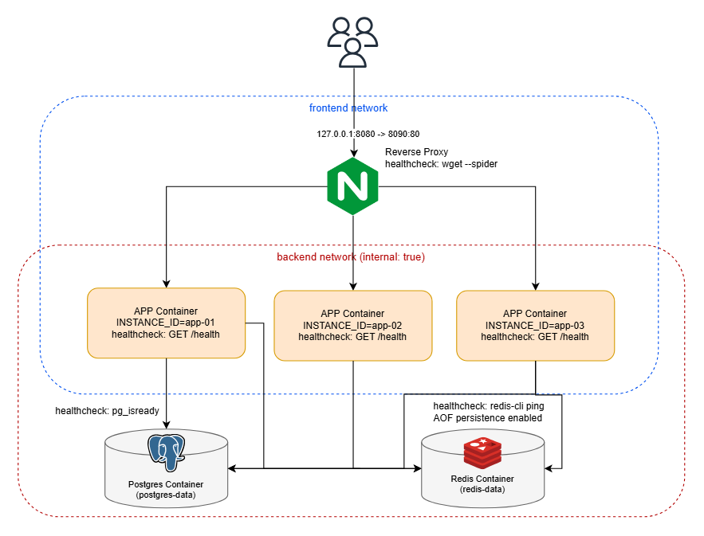
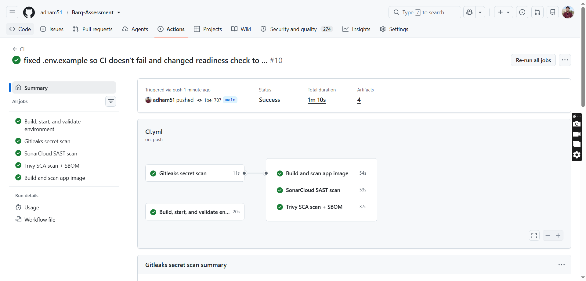

# BARQ Academy — DevOps Internship Task

A Flask API behind NGINX, load-balanced across three instances, backed by PostgreSQL and Redis.
It shipped broken; this repo is the investigation, the fix, and the tests proving it.

> This is the final state: three app instances (`app-01`/`02`/`03`) behind NGINX on public port
> **8090**. The third instance and the port change were added live in the recorded video (see
> `docs/EVIDENCE_INDEX.md`); this README documents the resulting final setup.


## Architecture Overview



## Setup

```bash
git clone <this-repo> && cd barq-academy
cp .env.example .env        # edit POSTGRES_PASSWORD before first run
```

## Build & start

```bash
docker compose -p barq-assessment up --build -d
docker compose -p barq-assessment ps
```

All six containers (`app-01`, `app-02`, `app-03`, `nginx`, `postgres`, `redis`) should show
`healthy` within about 15 seconds. If not: `docker compose -p barq-assessment logs --no-color`.

## Endpoints

| Endpoint | Method | Purpose |
|---|---|---|
| `/` | GET | app response + instance identity |
| `/health` | GET | process liveness only |
| `/ready` | GET | 200 only if PostgreSQL + Redis both respond, else 503 |
| `/instance` | GET | which backend answered (also in `X-Instance-ID` header) |
| `/records` | GET/POST | list / create PostgreSQL records |
| `/counter` | GET | atomically increments a Redis-backed counter |

```bash
curl -i http://127.0.0.1:8090/ready
curl -H 'Content-Type: application/json' -d '{"title":"proof"}' http://127.0.0.1:8090/records
curl http://127.0.0.1:8090/records
curl http://127.0.0.1:8090/counter
curl http://127.0.0.1:8090/instance
```

## Test

```bash
python3 validate.py --url http://127.0.0.1:8090 --expected-instances app-01,app-02,app-03
```

Checks public access, every endpoint, both backend identities, Postgres/Redis readiness,
network isolation, and that no forbidden host ports are published. Prints PASS/FAIL per check
and exits non-zero on any failure — this is what CI runs on every push/PR.

## Failure test

```bash
./failure_test.sh
```

Stops `app-01`, hits `/instance` repeatedly while it's down (prints real responses and
`NO RESPONSE` lines, not a silent wait), brings it back, and proves round-robin resumes across
both identities.

## Backup & restore

```bash
./backup.sh                                   # pg_dump -> backups/barq_tasks_<UTC-timestamp>.sql.gz
./restore.sh backups/barq_tasks_<ts>.sql.gz   # add --clean to restore into an empty database
```

Persistence proof used throughout this project:
```bash
curl -d '{"title":"persistence proof"}' -H 'Content-Type: application/json' http://127.0.0.1:8090/records
./backup.sh
docker compose -p barq-assessment up -d --force-recreate app-01 app-02 app-03 postgres   # volume kept
curl http://127.0.0.1:8090/records   # record still there
```

## Stop / cleanup

```bash
docker compose -p barq-assessment down          # keeps postgres-data / redis-data volumes
docker compose -p barq-assessment down --volumes  # only when you intend to wipe all data
```

## Log analysis

Three historical logs (`logs/access.log`, `logs/error.log`, `logs/application.log`) covering a
30-minute incident window were parsed and correlated with `scripts/log_analysis.py`
(`python3 scripts/log_analysis.py`). Full answers, evidence, and a timeline: [log_analysis.md](log_analysis.md).

## CI

`.github/workflows/CI.yml` runs on every push and pull request: checkout → shell/Python syntax
checks → `docker compose config` → build → start → wait for `/ready` → `validate.py`. A failing
`validate.py` fails the required `validate` job.

I forgot to re-run validation on 8090/3 instances live during the video, so the fix is committed
and proven in CI instead: the `validate` job now runs
`python3 validate.py --url http://127.0.0.1:8090 --expected-instances app-01,app-02,app-03`
against the final three-instance setup, and the successful run is below.



### DevSecOps pipeline

The pipeline is orchestrated via GitHub Actions and runs the following security tools, in
parallel with the required `validate` job:

- **Secret scanning:** Gitleaks — detects hardcoded secrets, passwords, and API keys.
- **SAST (Static Application Security Testing):** SonarQube Cloud — analyzes code for bugs,
  vulnerabilities, and code smells.
- **SCA (Software Composition Analysis):** Trivy — scans project dependencies for known
  vulnerabilities and generates an SBOM.
- **Container security:** Trivy — scans the built Docker image for OS and library vulnerabilities.

These four jobs run in parallel and are deliberately non-blocking (see the "What does green CI
prove" answer below) — they upload findings to the Security tab but don't gate the required job.

## Documentation

| File | Contents |
|---|---|
| [troubleshooting.md](troubleshooting.md) | Investigation journal — symptoms, hypotheses, failed attempts, fixes |
| [decisions.md](decisions.md) | Technical decisions, alternatives, trade-offs |
| [security_review.md](security_review.md) | 10 concrete risks/improvements, implemented vs. planned |
| [log_analysis.md](log_analysis.md) | Full log analysis with reproducible evidence |
| [AI_USAGE.md](AI_USAGE.md) | AI tools used, what was changed/rejected, how it was verified |
| [docs/EVIDENCE_INDEX.md](docs/EVIDENCE_INDEX.md) | requirement → file/output → commit → video timestamp |

## Required questions

**What failed first? What proved the cause? Which failed attempt taught you something?**

1. The first visible failure was the healthcheck. Both app containers showed `unhealthy` because the healthcheck probed `/healthz` while Flask only implements `/health`.

2. This was proved by reading the container logs (repeated 404s) side by side with the source route table. The same investigation surfaced a second, unrelated bug: `app-02`'s `INSTANCE_ID` was hardcoded to `"app-01"`, so both containers reported the same identity.

3. The failed attempt that taught the most was assuming a Postgres/Redis connectivity problem first. The logs showed the process was handling HTTP fine, which pointed the investigation to the route/config layer instead.

Full entries: [troubleshooting.md](troubleshooting.md).

**What patterns did the logs reveal? How did you avoid double-counting requests?**

1. Three distinct, non-overlapping incidents showed up inside one 30-minute window: a proxy-level connection refusal to one backend (502s), a two-part dependency failure (Redis timeouts, then separately a Postgres auth failure, not one incident as an early draft wrongly assumed), and a proxy read-timeout window (504s) where the app actually finished the request late.

2. Double-counting was avoided by deduplicating on `(request_id, timestamp)` per file before counting anything.

3. A retry (a comma-separated `upstream` field) was treated as one client request with multiple attempts, not as multiple requests.

Full evidence: [log_analysis.md](log_analysis.md).

**How do requests flow? Why these ports, networks and readiness checks?**  
Client → NGINX (`:8090` on `frontend`) → round-robin to `app-01`/`app-02`/`app-03` (on both `frontend`
and `backend` networks) → PostgreSQL/Redis (`backend`, `internal: true`). Only NGINX publishes a
host port; Postgres/Redis have none. `backend` is isolated so NGINX has no network path to the
database or cache even if compromised. `/health` checks the process only (fast, no dependency);
`/ready` checks Postgres + Redis so no instance is ever marked ready before it can actually serve
real requests — see [decisions.md #2](decisions.md#decision-2) and security_review.md #2/#3.

**Why these timeouts, retries, restart settings and resource limits?**  
`proxy_next_upstream off` and `max_fails=0` are deliberate: they keep a backend failure visible
in logs/tests as the assessment asks, instead of NGINX silently masking it with a retry (would
hide the failure that `failure_test.sh` needs to prove) — full rationale in
[decisions.md #2](decisions.md#decision-2). The restart policy and the exact per-service CPU/memory
numbers are explained in [decisions.md #6](decisions.md#decision-6).

**When should validation fail? What does green CI prove, or not prove?**  
`validate.py` should fail whenever public access, any endpoint, either backend identity, or
Postgres/Redis readiness doesn't respond correctly, or when network isolation/forbidden ports are
violated.

Green CI proves the stack builds, starts, becomes ready, and passes those checks on a fresh
runner at that commit, that's the required `validate` job, and it's the only job whose failure is meant to fail the run. 

The four security jobs (`secret_scanning`, `sast_scan`, `sca_scan`,
`container_security`) run in parallel and are deliberately non-blocking: both Trivy scans are set
to `exit-code: '0'`, so they upload SARIF/SBOM findings to the Security tab but never fail the
job even on a HIGH/CRITICAL result, by design. So green CI does **not** prove the app is free of
security findings.  


**Which single points of failure remain? How would you fix them in production?**  
NGINX itself (a single proxy container), PostgreSQL (a single instance, no replica), and Redis
(a single instance, no replica) are all SPOFs.   

Production fix: an externally managed load
balancer like AWS ALB or multiple NGINX replicas, managed/replicated PostgreSQL (or a HA setup with
automatic failover), and Redis replication or a managed Redis service. 


**What would you improve? How did you verify AI-assisted work?**  
Next: DAST in CI, severity-gated security scanning instead of report-only, encrypted off-host
backups, and replacing the current "observable but not resilient" NGINX failover with real
passive health checks for production use. Every AI-assisted change in this repo was independently
re-run and checked against raw output before being accepted — details and specific corrections
(including one I initially got wrong and caught by cross-checking two independent analyses) are
in [AI_USAGE.md](AI_USAGE.md).
